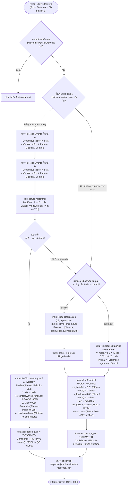
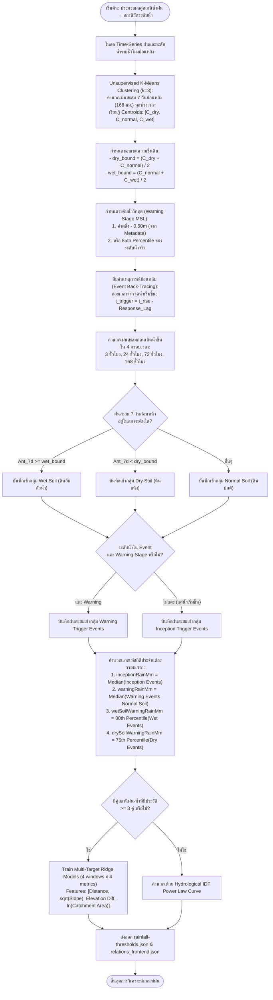

# เอกสารทางเทคนิคสถาปัตยกรรม Machine Learning และแบบจำลองอุทกวิทยา
# (Technical Architecture of ML & Hydrological Response Models)

เอกสารนี้อธิบายรายละเอียดเชิงลึกของกระบวนการทำงาน, ทฤษฎีคณิตศาสตร์/ฟิสิกส์ชลศาสตร์, อัลกอริทึม Machine Learning และ Flow การตัดสินใจที่ใช้ในระบบ `flood-analysis-model` ทั้งในส่วนของ **การคำนวณเวลาการเดินทางของน้ำ (Travel Time Engine)** และ **การวิเคราะห์เกณฑ์ฝนเตือนภัย (Rainfall Trigger Threshold Engine)**

---

## สารบัญ (Table of Contents)
1. [ภาพรวมสถาปัตยกรรมแบบจำลอง (Architecture Overview)](#1-ภาพรวมสถาปัตยกรรมแบบจำลอง-architecture-overview)
2. [ทฤษฎีพื้นฐานที่ใช้ในระบบ (Underlying Scientific Principles)](#2-ทฤษฎีพื้นฐานที่ใช้ในระบบ-underlying-scientific-principles)
3. [โมเดลที่ 1: Travel Time & Flood Propagation Engine](#3-โมเดลที่-1-travel-time--flood-propagation-engine)
   - [Mermaid Flowchart: Travel Time Decision Flow](#mermaid-flowchart-travel-time-decision-flow)
   - [ขั้นตอนการสกัดและจับคู่คลื่นน้ำ (Tri-Feature Event Matching)](#ขั้นตอนการสกัดและจับคู่คลื่นน้ำ-tri-feature-event-matching)
   - [ที่มาและการคำนวณค่า Typical / Min / Max Travel Time](#ที่มาและการคำนวณค่า-typical--min--max-travel-time)
   - [Physics-Informed Ridge Regression สำหรับสถานีที่ไม่มีข้อมูล](#physics-informed-ridge-regression-สำหรับสถานีที่ไม่มีข้อมูล)
4. [โมเดลที่ 2: Empirical Rainfall-Runoff Trigger Engine](#4-โมเดลที่-2-empirical-rainfall-runoff-trigger-engine)
   - [Mermaid Flowchart: Rainfall Threshold & Soil Moisture Flow](#mermaid-flowchart-rainfall-threshold--soil-moisture-flow)
   - [Unsupervised K-Means Soil Moisture Clustering (AMC)](#unsupervised-k-means-soil-moisture-clustering-amc)
   - [การสืบค้นย้อนกลับ (Event Back-Tracing) & 4 กรอบเวลา (3h, 24h, 72h, 168h)](#การสืบค้นย้อนกลับ-event-back-tracing--4-กรอบเวลา-3h-24h-72h-168h)
   - [ที่มาของเกณฑ์ Inception, Warning, Wet Soil และ Dry Soil](#ที่มาของเกณฑ์-inception-warning-wet-soil-และ-dry-soil)
5. [สรุปตัวแปรทางคณิตศาสตร์และ Schema ข้อมูล (Mathematical Notation & Schema)](#5-สรุปตัวแปรทางคณิตศาสตร์และ-schema-ข้อมูล)

---

## 1. ภาพรวมสถาปัตยกรรมแบบจำลอง (Architecture Overview)

ระบบถูกออกแบบด้วยสถาปัตยกรรม **Decoupled Physics-Informed Machine Learning (PIML)** เพื่อแก้ปัญหาความซับซ้อนของน้ำหลากในลุ่มน้ำ โดยแยกการประมวลผลออกเป็น 2 มิติอิสระ:

```
┌─────────────────────────────────────────────────────────────────────────────────┐
│                           FLOOD ANALYSIS MODEL PIPELINE                         │
└─────────────────────────────────────────────────────────────────────────────────┘
                                       │
        ┌──────────────────────────────┴──────────────────────────────┐
        ▼                                                             ▼
┌──────────────────────────────────────────┐    ┌──────────────────────────────────────────┐
│         [STEP 4] WATER-TO-WATER          │    │          [STEP 5] RAIN-TO-WATER          │
│        (Travel Time Engine)              │    │        (Rainfall Threshold Engine)       │
├──────────────────────────────────────────┤    ├──────────────────────────────────────────┤
│ • Focus: การเคลื่อนตัวของมวลน้ำในลำน้ำหลัก   │    │ • Focus: ผลกระทบของฝนเฉพาะที่ใน Catchment │
│ • Input: Historical Water Level, OSM     │    │ • Input: Historical Hourly Rain & Stage, │
│   River Network, DEM Slope & Elevation   │    │   7-day Antecedent Rain, Bank Level      │
│ • Output: Typical / Min / Max Travel Time│    │ • Output: Inception & Warning Thresholds │
│   (สำหรับคู่สถานีแม่น้ำ Observed/Estimated)│    │   (3h, 24h, 72h, 168h แยกตามสภาพดิน)       │
└──────────────────────────────────────────┘    └──────────────────────────────────────────┘
```

---

## 2. ทฤษฎีพื้นฐานที่ใช้ในระบบ (Underlying Scientific Principles)

ระบบผสมผสานทฤษฎีทางชลศาสตร์ สถิติอุทกวิทยา และอัลกอริทึม ML 6 ทฤษฎีหลัก:

| ทฤษฎี / หลักการ | สาขาวิชา | การนำมาประยุกต์ใช้ในโค้ด |
| :--- | :--- | :--- |
| **Kleitz-Seddon Law & Kinematic Wave** | ชลศาสตร์ลำน้ำเปิด (Open-Channel Hydraulics) | คำนวณความเร็วคลื่นน้ำ $C_e = \frac{dQ}{dA} \approx 1.5 - 1.7 V$ และควบคุมขอบเขตความเร็วทางกายภาพ |
| **Manning-Strickler Formula** | วิศวกรรมชลศาสตร์ | นำ $\sqrt{\text{Slope}}$ มาใช้เป็น Feature ใน Ridge Regression ตามสูตร $V \propto S^{1/2}$ |
| **Hydrograph Moment Analysis** | อุทกวิทยาลำน้ำ (River Hydrology) | คำนวณจุดศูนย์ถ่วงมวลน้ำ (Centroid) และจุดกึ่งกลางยอดน้ำ (Plateau Midpoint) |
| **Antecedent Moisture Condition (AMC)** | อุทกวิทยาการซึมและน้ำท่า (USDA-SCS) | จัดกลุ่มความชื้นในดิน 7 วันเป็น 3 ระดับ (แห้ง / ปกติ / อิ่มตัว) ด้วย K-Means Clustering |
| **Intensity-Duration-Frequency (IDF) Power Scaling** | อุทกวิทยาทางสถิติ | จำลองเส้นโค้งฝนสะสมแบบทวีคูณตามกรอบเวลา $P(t) \propto t^{0.38}$ |
| **L2-Regularized Linear Model (Ridge)** | Machine Learning | ถ่ายทอดคุณสมบัติทางชลศาสตร์ไปยังคู่สถานีที่ไม่มีข้อมูลประวัติศาสตร์ (Zero Data Leakage) |

---

## 3. โมเดลที่ 1: Travel Time & Flood Propagation Engine

### Mermaid Flowchart: Travel Time Decision Flow



---

### ขั้นตอนการสกัดและจับคู่คลื่นน้ำ (Tri-Feature Event Matching)

1. **การตรวจจับเหตุการณ์น้ำหลาก (`detect_flood_rise_and_plateau_events`):**
   * ค้นหาช่วงเวลาที่ระดับน้ำสูงขึ้นต่อเนื่องอย่างน้อย 4 ชั่วโมง (`min_rise_hours = 4`) โดยยอมรับสัญญาณรบกวนของเซนเซอร์ไม่เกิน 1 ซม.
   * ติดตามยอดน้ำสูงสุด (`peak_val`) และหาช่วงขอบของยอดน้ำทรงตัว (Plateau Window) ที่ระดับน้ำเปลี่ยนแปลงไม่เกิน 2 ซม. (`plateau_diff_threshold = 0.02`)
   * คำนวณจุดสำคัญ 3 จุด:
     $$\text{Plateau Midpoint} = \frac{T_{\text{plateau\_start}} + T_{\text{plateau\_end}}}{2}$$
     $$\text{Volume Centroid} = T_{\text{rise\_start}} + \frac{\sum (h_t - h_{\text{base}}) \cdot \Delta t}{\sum (h_t - h_{\text{base}})}$$

2. **การจับคู่คลื่นน้ำข้ามสถานี (`calculate_observed_travel_time`):**
   * ตรวจสอบว่ายอดน้ำที่สถานี B เกิดหลังสถานี A ภายในช่วงเวลา $0.5 \le \Delta t \le 72.0\text{ ชั่วโมง}$
   * กรองเหตุการณ์ฝนตกเฉพาะที่ (Local Flash Flood) ออกอัตโนมัติ เพราะหากสถานี B มีน้ำขึ้นแต่สถานี A ไม่มีน้ำขึ้น Event นั้นจะไม่มีคู่ Match และถูกคัดทิ้ง

---

### ที่มาและการคำนวณค่า Typical / Min / Max Travel Time

| ค่าเอาต์พุต | สมการ / วิธีคำนวณ | ความหมายและเหตุผลทางชลศาสตร์ |
| :--- | :--- | :--- |
| **Typical Travel Time** (`travel_time_hours`) | $\text{Median}(\Delta t_{\text{plateau\_mid}})$ | ค่ามัธยฐานของเวลาระหว่างจุดกึ่งกลางยอดน้ำทรงตัว เป็นค่าตัวแทนความเร็วเฉลี่ยของมวลน้ำก้อนใหญ่ (ทนทานต่อ Outlier) |
| **Minimum Travel Time** (`travel_time_hours_min`) | $\text{Percentile}_{10}(\Delta t_{\text{wave\_front}}) \times 0.70$ | อิงจากจุดเริ่มต้นหัวคลื่นน้ำ (Wave Front Arrival) พร้อมใส่ **Safety Factor $-30\%$** เพื่อใช้ในการเตือนภัยล่วงหน้าแบบ Early Warning (กรณีน้ำหลากไหลเร็วเต็มตลิ่ง) |
| **Maximum Travel Time** (`travel_time_hours_max`) | $\text{Percentile}_{90}(\Delta t_{\text{plateau\_mid}})$ | อิงจากเปอร์เซ็นไทล์ที่ 90 เพื่อรองรับกรณีน้ำแผ่ออกทุ่ง/ลานพักน้ำ ทำให้คลื่นน้ำเดินทางช้ากว่าปกติ |
| **Average Holding Hours** (`avg_holding_duration_hours`) | $\text{Mean}(T_{\text{plateau\_end}} - T_{\text{plateau\_start}})$ | ระยะเวลาเฉลี่ยที่ระดับน้ำเอ่อค้างอยู่บนยอด ก่อนจะเริ่มลดระดับลง |

---

### Physics-Informed Ridge Regression สำหรับสถานีที่ไม่มีข้อมูล

สำหรับคู่สถานีที่ไม่มีประวัติข้อมูลระดับน้ำ (Unobserved Pairs) โมเดลจะฝึกสอน **Ridge Regression** จากคู่สถานีที่มีข้อมูลในลุ่มน้ำเดียวกัน:

$$\min_{\mathbf{w}} \left\{ \|\mathbf{y} - \mathbf{X}\mathbf{w}\|_2^2 + \alpha \|\mathbf{w}\|_2^2 \right\}$$

โดย Feature Vector ถูกสร้างตามหลักชลศาสตร์:
$$\mathbf{x} = \left[ \text{Distance (km)}, \sqrt{\max(0.00001, \text{Slope})}, \Delta Z \text{ (m)} \right]$$

หากไม่มีข้อมูลคู่สถานีในลุ่มน้ำเพียงพอ ($n < 3$) ระบบจะ Fallback ไปใช้สมการความเร็วคลื่นน้ำเชิงกายภาพ (Manning Kinematic Approximation):
$$v_{\text{bankfull}} = \max\left(3.8, \min\left(11.5, 7.2 \times \left(\frac{S}{0.001}\right)^{0.22}\right)\right) \text{ km/h}$$
$$v_{\text{lowflow}} = \max\left(1.8, \min\left(5.5, 3.6 \times \left(\frac{S}{0.001}\right)^{0.18}\right)\right) \text{ km/h}$$
$$v_{\text{mean}} = \max\left(2.5, \min\left(9.0, 5.2 \times \left(\frac{S}{0.001}\right)^{0.20}\right)\right) \text{ km/h}$$

---

## 4. โมเดลที่ 2: Empirical Rainfall-Runoff Trigger Engine

### Mermaid Flowchart: Rainfall Threshold & Soil Moisture Flow



---

### Unsupervised K-Means Soil Moisture Clustering (AMC)

ในอดีตเกณฑ์ความชื้นในดินมักถูกกำหนดแบบ Hardcode (เช่น ดินแห้ง < 35 mm, ดินชุ่ม > 100 mm) แต่ในโมเดลนี้ ระบบใช้ **K-Means Clustering ($k=3$)** เพื่อเรียนรู้จากพฤติกรรมฝนของพื้นที่จริง:

```text
  ความชื้นต่ำ (Dry)           ความชื้นปานกลาง (Normal)          ความชื้นสูง (Wet)
[       C_dry       ] ─── dry_bound ─── [      C_normal      ] ─── wet_bound ─── [       C_wet       ]
      (ดินแห้ง)                                (ดินปกติ)                               (ดินอิ่มตัวน้ำ)
```

* $\text{dry\_bound} = \frac{C_{\text{dry}} + C_{\text{normal}}}{2}$
* $\text{wet\_bound} = \frac{C_{\text{normal}} + C_{\text{wet}}}{2}$

---

### การสืบค้นย้อนกลับ (Event Back-Tracing) & 4 กรอบเวลา

เมื่อเกิดเหตุการณ์น้ำเริ่มยกตัวที่เวลา $T_{\text{rise}}$ ระบบจะทำการสืบค้นย้อนกลับหา **เวลาที่ฝนเริ่มตกกระตุ้น (Effective Trigger Time)**:
$$T_{\text{trigger}} = T_{\text{rise}} - \text{Lag}_{\text{catchment}}$$

จากนั้นระบบจะคำนวณผลรวมฝนสะสมแบบกลิ้ง (Rolling Accumulation) ย้อนหลังจาก $T_{\text{trigger}}$ ใน 4 กรอบเวลาหลัก:
* **3 ชั่วโมง (3h):** เตือนภัยน้ำหลากฉับพลัน/น้ำป่าไหลหลาก (Flash Flood)
* **24 ชั่วโมง (24h):** เตือนภัยน้ำท่วมขังและน้ำเอ่อล้นตลิ่งประจำวัน (Daily Inundation)
* **72 ชั่วโมง (72h):** เตือนภัยพายุฝนแช่ตัวต่อเนื่อง (3-Day Storm Accumulation)
* **168 ชั่วโมง (168h / 7 วัน):** ดัชนีความอิ่มตัวของผืนดินทั้งลุ่มน้ำ (7-Day Basin Saturation)

---

### ที่มาของเกณฑ์ Inception, Warning, Wet Soil และ Dry Soil

สำหรับแต่ละกรอบเวลา ($3\text{h}, 24\text{h}, 72\text{h}, 168\text{h}$) ระบบจะให้ค่าเกณฑ์ 4 ระดับ:

| ชื่อพารามิเตอร์ | วิธีการคำนวณทางสถิติ | ความหมายและการนำไปแจ้งเตือน |
| :--- | :--- | :--- |
| `inceptionRainMm` | $\text{Median}(\text{Rain}_{\text{inception}})$ | **เกณฑ์ฝนเริ่มตอบสนอง:** ปริมาณฝนสะสมขั้นต่ำที่เริ่มทำให้ระดับน้ำในลำน้ำกระดิกตัวสูงขึ้น |
| `warningRainMm` | $\text{Median}(\text{Rain}_{\text{warning, normal}})$ | **เกณฑ์ฝนเตือนภัยสภาวะดินปกติ:** ปริมาณฝนสะสมที่ทำให้ระดับน้ำแตะระดับวิกฤต/ล้นตลิ่ง |
| `wetSoilWarningRainMm` | $\text{Percentile}_{30}(\text{Rain}_{\text{warning, wet}})$ หรือ $0.68 \times \text{Warning}$ | **เกณฑ์ฝนเตือนภัยเมื่อดินอิ่มตัวน้ำ:** เกณฑ์จะลดลง $\approx 30-35\%$ เพราะดินไม่สามารถดูดซับน้ำได้อีกแล้ว ฝนตกเพียงเล็กน้อยจะกลายเป็นน้ำท่าทันที |
| `drySoilWarningRainMm` | $\text{Percentile}_{75}(\text{Rain}_{\text{warning, dry}})$ หรือ $1.45 \times \text{Warning}$ | **เกณฑ์ฝนเตือนภัยเมื่อดินแห้ง:** เกณฑ์จะสูงขึ้น $\approx 45-50\%$ เนื่องจากดินและพื้นที่รับน้ำช่วยดูดซับน้ำก้อนแรกไว้ (Initial Abstraction Loss) |

---

## 5. สรุปตัวแปรทางคณิตศาสตร์และ Schema ข้อมูล

### 1. Schema เอาต์พุต Travel Time (`observed-response.json` & `estimated-response.json`)
```json
{
  "station_id": "Y.1C",
  "target_station_id": "Y.20",
  "distance_km": 42.5,
  "river_slope": 0.00045,
  "elevation_diff_m": 8.2,
  "travel_time_hours": 7.5,
  "travel_time_hours_min": 4.5,
  "travel_time_hours_max": 9.2,
  "travel_time_minutes": 450,
  "travel_time_minutes_min": 270,
  "travel_time_minutes_max": 552,
  "avg_holding_duration_hours": 8.0,
  "matched_event_count": 14,
  "response_type": "OBSERVED",
  "confidence": "HIGH",
  "detection_rule": "continuous_rise_4h_with_plateau_midpoint"
}
```

### 2. Schema เอาต์พุต Rainfall Thresholds (`rainfall-thresholds.json`)
```json
{
  "from_station_id": "R001",
  "to_station_id": "Y.1C",
  "distance_km": 12.8,
  "thresholdConfidence": "HIGH",
  "matchedEventCount": 9,
  "soilMoistureBounds": {
    "dryRegimeBoundMm": 38.5,
    "wetRegimeBoundMm": 115.0
  },
  "rainfallThresholds": {
    "3h": {
      "inceptionRainMm": 22.0,
      "warningRainMm": 45.0,
      "wetSoilWarningRainMm": 31.0,
      "drySoilWarningRainMm": 65.0
    },
    "24h": {
      "inceptionRainMm": 55.0,
      "warningRainMm": 90.0,
      "wetSoilWarningRainMm": 62.0,
      "drySoilWarningRainMm": 130.0
    },
    "72h": {
      "inceptionRainMm": 85.0,
      "warningRainMm": 140.0,
      "wetSoilWarningRainMm": 98.0,
      "drySoilWarningRainMm": 200.0
    },
    "168h": {
      "inceptionRainMm": 120.0,
      "warningRainMm": 195.0,
      "wetSoilWarningRainMm": 135.0,
      "drySoilWarningRainMm": 280.0
    }
  }
}
```

---

## เอกสารโค้ดต้นทางที่เกี่ยวข้อง (Source Code References)
* [`scripts/train_response_model.py`](file:///home/korarit/Desktop/flood-analysis-project/flood-analysis-model/scripts/train_response_model.py) : Pipeline หลักในการคำนวณและ Train โมเดล Travel Time
* [`scripts/calculate_rainfall_thresholds.py`](file:///home/korarit/Desktop/flood-analysis-project/flood-analysis-model/scripts/calculate_rainfall_thresholds.py) : Pipeline หลักในการวิเคราะห์เกณฑ์ฝน 4 กรอบเวลา
* [`scripts/modules/hydrology_model.py`](file:///home/korarit/Desktop/flood-analysis-project/flood-analysis-model/scripts/modules/hydrology_model.py) : ฟังก์ชันคำนวณทางคณิตศาสตร์, K-Means Clustering, Ridge Regression, และ Tri-Feature Matching
* [`scripts/generate_osm_waterlevel_relations.py`](file:///home/korarit/Desktop/flood-analysis-project/flood-analysis-model/scripts/generate_osm_waterlevel_relations.py) : โครงข่ายลำน้ำ Directed Graph จาก OpenStreetMap Vector
