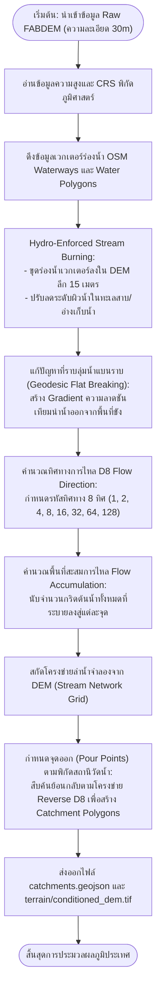
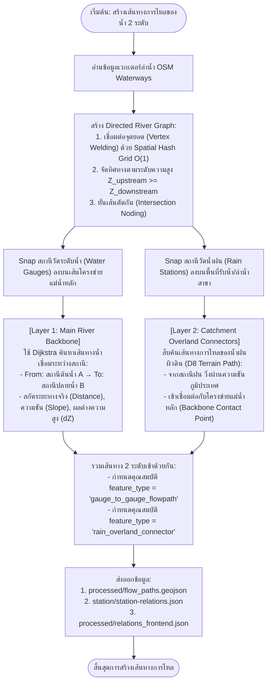

# เอกสารทางเทคนิคโครงข่ายทิศทางการไหลของน้ำและการประมวลผลภูมิประเทศ
# (Technical Architecture of Water Flow, Terrain & River Topology Engine)

เอกสารนี้อธิบายรายละเอียดเชิงลึกของกระบวนการวิเคราะห์ข้อมูลภูมิประเทศ (Terrain Processing), การขุดร่องน้ำชลศาสตร์ (Hydro-Enforced DEM Conditioning), การสร้างโครงข่ายแม่น้ำแบบเวกเตอร์ (Directed River Graph), การแบ่งพื้นที่รับน้ำ (Catchment Delineation) และระบบสืบค้นเส้นทางการไหลของน้ำแบบผสม 2 ระดับ (**2-Layer Hybrid Flow Path Engine**) ในระบบ `flood-analysis-model`

---

## สารบัญ (Table of Contents)
1. [ภาพรวมสถาปัตยกรรมโครงข่ายการไหล (Water Flow Architecture Overview)](#1-ภาพรวมสถาปัตยกรรมโครงข่ายการไหล-water-flow-architecture-overview)
2. [ทฤษฎีพื้นฐานทางชลศาสตร์และภูมิสารสนเทศ (Core GIS & Hydrological Theories)](#2-ทฤษฎีพื้นฐานทางชลศาสตร์และภูมิสารสนเทศ-core-gis--hydrological-theories)
3. [กระบวนการที่ 1: การประมวลผลภูมิประเทศ (DEM Conditioning & Hydrological Flow)](#3-กระบวนการที่-1-การประมวลผลภูมิประเทศ-dem-conditioning--hydrological-flow)
   - [Mermaid Flowchart: Terrain & DEM Processing Pipeline](#mermaid-flowchart-terrain--dem-processing-pipeline)
   - [การขุดร่องน้ำและการแก้ไขแอ่งน้ำขัง (Stream Burning & Flat Resolution)](#การขุดร่องน้ำและการแก้ไขแอ่งน้ำขัง-stream-burning--flat-resolution)
   - [ทฤษฎี D8 Flow Direction และ Flow Accumulation](#ทฤษฎี-d8-flow-direction-และ-flow-accumulation)
   - [การสร้างขอบเขตพื้นที่รับน้ำ (Catchment Polygon Delineation)](#การสร้างขอบเขตพื้นที่รับน้ำ-catchment-polygon-delineation)
4. [กระบวนการที่ 2: โครงข่ายแม่น้ำและการสืบค้นเส้นทาง (2-Layer Hybrid Flow Paths)](#4-กระบวนการที่-2-โครงข่ายแม่น้ำและการสืบค้นเส้นทาง-2-layer-hybrid-flow-paths)
   - [Mermaid Flowchart: 2-Layer Hybrid River Routing Pipeline](#mermaid-flowchart-2-layer-hybrid-river-routing-pipeline)
   - [การสร้าง Directed River Graph จาก OpenStreetMap Vector](#การสร้าง-directed-river-graph-จาก-openstreetmap-vector)
   - [การตรึงสถานีเข้าสู่โครงข่ายแม่น้ำ (Station-to-Stream Snapping)](#การตรึงสถานีเข้าสู่โครงข่ายแม่น้ำ-station-to-stream-snapping)
   - [การเชื่อมต่อ 2 ระดับ: Gauge-to-Gauge Backbone vs Rain-to-Gauge Overland](#การเชื่อมต่อ-2-ระดับ-gauge-to-gauge-backbone-vs-rain-to-gauge-overland)
5. [โครงสร้างข้อมูลและ Schema ผลลัพธ์ (Data Schema & Geometry Outputs)](#5-โครงสร้างข้อมูลและ-schema-ผลลัพธ์-data-schema--geometry-outputs)

---

## 1. ภาพรวมสถาปัตยกรรมโครงข่ายการไหล (Water Flow Architecture Overview)

ระบบวิเคราะห์การไหลของน้ำถูกออกแบบด้วยสถาปัตยกรรม **2-Layer Hybrid Hydrological Routing Engine** เพื่อแก้ปัญหาข้อจำกัดของโมเดล DEM บริสุทธิ์ (ที่มักเกิดรอยต่อสะพาน ถนน หรือที่ราบลุ่มน้ำขัง) และข้อจำกัดของเวกเตอร์ OSM (ที่ไม่มีข้อมูลระดับความสูงและความชัน):

```
┌───────────────────────────────────────────────────────────────────────────────────────┐
│                       HYBRID WATER FLOW & TERRAIN ENGINE                              │
└───────────────────────────────────────────────────────────────────────────────────────┘
                                           │
         ┌─────────────────────────────────┴─────────────────────────────────┐
         ▼                                                                   ▼
┌───────────────────────────────────────────────┐   ┌───────────────────────────────────────────────┐
│           TERRAIN HYDROLOGY ENGINE            │   │          DIRECTED RIVER GRAPH ENGINE          │
│       (FABDEM 30m + D8 Flow Dynamics)         │   │      (OSM Waterways + Elevation Routing)      │
├───────────────────────────────────────────────┤   ├───────────────────────────────────────────────┤
│ • Hydro-Enforced Stream Burning (ขุดร่อง 15m) │   │ • Topological Directed Graph (DAG)            │
│ • Geodesic Flat & Pit Resolution              │   │ • Spatial Hash Grid O(1) Vertex Welding       │
│ • D8 Flow Direction & Flow Accumulation       │   │ • Station-to-Stream Orthogonal Snapping       │
│ • Catchment & Sub-watershed Delineation       │   │ • Dijkstra Shortest Downstream Flow Paths     │
└───────────────────────────────────────────────┘   └───────────────────────────────────────────────┘
                                           │                                 │
                                           └────────────────┬────────────────┘
                                                            ▼
                                    ┌───────────────────────────────────────────────┐
                                    │          2-LAYER HYBRID FLOW PATHS            │
                                    ├───────────────────────────────────────────────┤
                                    │ 1. Layer 1 (Main Stream Backbone):            │
                                    │    เส้นทางน้ำหลักเชื่อมสถานีวัดน้ำ (Gauge)     │
                                    │ 2. Layer 2 (Catchment Overland Connectors):   │
                                    │    เส้นทางน้ำหลากจากสถานีฝนลงสู่ลำน้ำหลัก     │
                                    └───────────────────────────────────────────────┘
```

---

## 2. ทฤษฎีพื้นฐานทางชลศาสตร์และภูมิสารสนเทศ (Core GIS & Hydrological Theories)

| ทฤษฎี / อัลกอริทึม | สาขาวิชา | หน้าที่ในระบบ |
| :--- | :--- | :--- |
| **D8 Flow Direction Algorithm** | ภูมิศาสตร์ชลศาสตร์ (O'Callaghan & Mark) | คำนวณทิศทางการไหลของน้ำไปยังกริดข้างเคียง 8 ทิศตามแนวลาดชันสูงสุด |
| **Stream Burning (AGREE / Trenching)** | การปรับสภาพแบบจำลองภูมิประเทศ | บังคับร่องน้ำเวกเตอร์ลงใน DEM ลึก 15 เมตร เพื่อป้องกันไม่ให้น้ำไหลข้ามถนน/สะพาน |
| **Wang & Liu Pit Filling & Flat Resolution** | การจำลองอุทกวิทยาเชิงตัวเลข | เติมหลุมยุบ (Sinks) และสร้างความลาดเอียงเทียมในที่ราบลุ่มน้ำแบนราบ |
| **Directed Acyclic Graph (DAG)** | ทฤษฎีกราฟและวิทยาการคอมพิวเตอร์ | จัดการโครงข่ายแม่น้ำแบบมีทิศทางตามแรงโน้มถ่วง ป้องกันการไหลวนลูป |
| **Spatial Hash Grid Indexing** | การประมวลผลเชิงพื้นที่ความเร็วสูง | รวมจุดเชื่อมต่อแม่น้ำ (Vertex Welding) และค้นหาสถานีใกล้เคียง |
| **Haversine Geodesic Meander Distance** | ภูมิมาตรศาสตร์ (Geodesy) | คำนวณระยะทางจริงตามความคดเคี้ยวของลำน้ำบนทรงกลมโลก |

---

## 3. กระบวนการที่ 1: การประมวลผลภูมิประเทศ (DEM Conditioning & Hydrological Flow)

### Mermaid Flowchart: Terrain & DEM Processing Pipeline



---

### การขุดร่องน้ำและการแก้ไขแอ่งน้ำขัง (Stream Burning & Flat Resolution)

1. **ปัญหาของ Raw DEM:** ข้อมูลความสูงจากดาวเทียม (SRTM/FABDEM) มักตรวจจับยอดสะพาน ถนน หรือคันดินกั้นน้ำเป็นแนวขวางลำน้ำ ทำให้น้ำจำลองไหลสะดุดหรือไหลออกนอกแม่น้ำจริง
2. **การทำ Hydro-Enforced Stream Burning (`burn_stream_network_into_dem`):**
   ระบบนำเส้นเวกเตอร์ลำน้ำจริงจาก OpenStreetMap มาขุดร่อง (Burn) ลงบนตารางกริด DEM ด้วยความลึก 15 เมตร:

$$Z_{\text{conditioned}}(r, c) = Z_{\text{dem}}(r, c) - 15.0$$

*(ใช้เฉพาะกริดพิกัด $(r, c)$ ที่ทับซ้อนกับร่องน้ำ OSM Stream Footprint)*

3. **การแก้ปัญหาที่ราบลุ่มน้ำขัง (`enforce_geodesic_flat_slope`):**
   สำหรับพื้นที่ราบเรียบที่ผลต่างความสูงเป็นศูนย์ ($\Delta Z = 0$) ระบบจะสร้างความลาดเอียงขนาดเล็กยิ่งยวด ($10^{-6}\text{ m/m}$) ชี้ตรงไปยังจุดทางออก เพื่อป้องกันไม่ให้เกิดกริดน้ำขัง (Sinks/Flats)

---

### ทฤษฎี D8 Flow Direction และ Flow Accumulation

#### 1. D8 Flow Direction
พิจารณากริดรอบตัว 8 ทิศ และเลือกทิศทางที่มี **ความลาดชันสูงสุด (Steepest Downward Slope)**:

$$S_i = \frac{Z_{\text{center}} - Z_i}{d_i}$$

* $Z_{\text{center}}$ : ระดับความสูงของเซลล์กึ่งกลาง
* $Z_i$ : ระดับความสูงของเซลล์ข้างเคียงทิศที่ $i$ ($i = 1, 2, \dots, 8$)
* $d_i$ : ระยะห่างระหว่างจุดศูนย์กลางเซลล์
  * สำหรับทิศหลัก (เหนือ, ใต้, ออก, ตก): $d_i = \text{Cell Size}$ (ประมาณ 30 เมตร)
  * สำหรับทิศทแยง (เฉียง): $d_i = \sqrt{2} \times \text{Cell Size}$ (ประมาณ 42.4 เมตร)

```text
  รหัสทิศทางการไหล D8 (Binary Direction Encoding):
  [ 32 ]  [ 64 ]  [ 128 ]       ( NW )   ( N )   ( NE )
  [ 16 ]  [ C  ]  [  1  ]       ( W  )  ( เซลล์ ) ( E  )
  [  8 ]  [  4 ]  [  2  ]       ( SW )   ( S )   ( SE )
```

#### 2. Flow Accumulation
คำนวณจำนวนเซลล์ต้นน้ำทั้งหมดที่ไหลมารวมกันที่เซลล์ปัจจุบัน:

$$\text{Acc}(u) = 1 + \sum_{v \in \text{Upstream}(u)} \text{Acc}(v)$$

* เซลล์ที่มีค่า $\text{Acc}$ สูง จะหมายถึงแนวแม่น้ำสายหลักและลำน้ำสาขา

---

### การสร้างขอบเขตพื้นที่รับน้ำ (Catchment Polygon Delineation)

1. นำพิกัดสถานีวัดน้ำที่ตรึงลงบนร่องน้ำแล้ว มากำหนดเป็น **จุดทางออกน้ำ (Pour Point / Outlet)**
2. ทำการสืบค้นย้อนกลับขึ้นต้นน้ำด้วย **Reverse D8 Graph Traversal**:
   รวบรวมทุกเซลล์กริดที่มีเส้นทางการไหลมุ่งตรงมายัง Pour Point นั้น
3. แปลงกลุ่มเซลล์กริดให้เป็นรูปหลายเหลี่ยมเชิงเวกเตอร์ (Vector Polygon Delineation) และส่งออกเป็น `catchments.geojson`

---

## 4. กระบวนการที่ 2: โครงข่ายแม่น้ำและการสืบค้นเส้นทาง (2-Layer Hybrid Flow Paths)

### Mermaid Flowchart: 2-Layer Hybrid River Routing Pipeline



---

### การสร้าง Directed River Graph จาก OpenStreetMap Vector

คลาส `DirectedRiverGraph` ใน [`graph_topology.py`](file:///home/korarit/Desktop/flood-analysis-project/flood-analysis-model/scripts/modules/graph_topology.py#L119) ทำหน้าที่สร้างกราฟเครือข่ายแม่น้ำ:

1. **Spatial Hash Grid Vertex Welding:**
   * จัดแบ่งพิกัดเป็นตารางกริดขนาดเล็ก ($\text{Tolerance} \approx 0.00035^{\circ} \approx 35\text{ เมตร}$)
   * จุดปลายของแม่น้ำที่อยู่ใกล้กันจะถูกเชื่อมประสานเป็นโหนดเดียวกันอัตโนมัติ ทำให้กราฟเชื่อมต่อกันต่อเนื่องตลอดทั้งสาย
2. **Elevation-Enforced Directionality:**
   * สุ่มอ่านค่าระดับความสูงจาก Conditioned DEM ที่จุดต้นและจุดปลายของทุก Segment
   * บังคับให้ทิศทางของเส้นเวกเตอร์ชี้จาก **ที่สูงลงสู่ที่ต่ำเสมอ ($Z_{\text{start}} \ge Z_{\text{end}}$)** ป้องกันปัญหาน้ำไหลย้อนทิศทาง

---

### การตรึงสถานีเข้าสู่โครงข่ายแม่น้ำ (Station-to-Stream Snapping)

สถานีวัดน้ำภาคสนามมักติดตั้งอยู่บนตลิ่งหรือข้างสะพาน ซึ่งพิกัด GPS จริงอาจคลาดเคลื่อนจากกึ่งกลางร่องน้ำเวกเตอร์:

1. ระบบทำการฉายภาพตั้งฉาก (Orthogonal Projection) จากพิกัดสถานี $P(x_p, y_p)$ ไปยังเส้นตรงของลำน้ำ $AB$:

$$L^2 = (x_b - x_a)^2 + (y_b - y_a)^2$$

$$t = \frac{(x_p - x_a)(x_b - x_a) + (y_p - y_a)(y_b - y_a)}{L^2}, \quad t \in [0, 1]$$

$$P_{\text{snap}} = A + t(B - A)$$

2. แทรกจุด $P_{\text{snap}}$ เข้าเป็นโหนดใหม่ในโครงข่ายแม่น้ำ และแบ่ง Edge ย่อยออกเป็น 2 ท่อนอย่างแม่นยำ

---

### การเชื่อมต่อ 2 ระดับ: Gauge-to-Gauge Backbone vs Rain-to-Gauge Overland

ระบบแบ่งเส้นทางการไหลออกเป็น 2 ชั้นอย่างชัดเจน:

```text
สถานีฝน (Rain Station R01)
       │
       │  [Layer 2: Rain Overland Connector]
       │  (ไหลตามความชัน D8 ภูมิประเทศผิวดิน)
       ▼
จุดบรรจบแม่น้ำ (River Entry Point)
       │
       │  [Layer 1: Main Stream Backbone]
       │  (ไหลตามแนวร่องน้ำแม่น้ำสายหลัก OSM)
       ▼
สถานีวัดระดับน้ำ (Water Gauge Y.1C)
       │
       │  [Layer 1: Main Stream Backbone]
       ▼
สถานีวัดระดับน้ำท้ายน้ำ (Water Gauge Y.20)
```

1. **Layer 1 (Gauge-to-Gauge Flowpath):**
   * เส้นทางสีฟ้าหลัก เชื่อมต่อระหว่างสถานีวัดระดับน้ำต้นน้ำและปลายน้ำ
   * เป็นเส้นทางเวกเตอร์ OSM แท้ที่เรียบเนียน ไม่แตกเป็นฟันปลา (Non-pixelated)
   * บันทึกระยะทาง ($\text{km}$), ความชัน ($\text{Slope}$), และเวลาเดินทาง ($\text{Travel Time}$)
2. **Layer 2 (Rain-to-Gauge Overland Connector):**
   * เส้นทางการไหลของน้ำฝนจากสถานีวัดน้ำฝนบนภูเขาหรือในทุ่ง ผ่านความลาดชันผิวดิน (D8 Flow Path) เข้าสู่ลำน้ำหลัก
   * ใช้ประเมินระยะเวลาตอบสนองของน้ำท่าผิวดิน ($\text{Overland Response Lag}$)

---

## 5. โครงสร้างข้อมูลและ Schema ผลลัพธ์ (Data Schema & Geometry Outputs)

### 1. Schema เส้นทางการไหล (`flow_paths.geojson`)
```json
{
  "type": "FeatureCollection",
  "features": [
    {
      "type": "Feature",
      "properties": {
        "feature_type": "gauge_to_gauge_flowpath",
        "routing": "hybrid_osm_d8",
        "from_station_id": "Y.1C",
        "from_station_name": "สะพานบ้านน้ำโค้ง",
        "to_station_id": "Y.20",
        "to_station_name": "บ้านห้วยสัก",
        "distance_km": 42.50,
        "river_slope": 0.000452,
        "elevation_diff_m": 8.20,
        "upstream_elev_m": 124.50,
        "downstream_elev_m": 116.30,
        "travel_time_hours": 7.50,
        "travel_time_minutes": 450
      },
      "geometry": {
        "type": "LineString",
        "coordinates": [
          [100.1425, 18.1562],
          [100.1438, 18.1541],
          [100.1480, 18.1495]
        ]
      }
    }
  ]
}
```

### 2. Schema ความสัมพันธ์ระหว่างสถานี (`station-relations.json`)
```json
{
  "from_station_id": "Y.1C",
  "from_station_name": "สะพานบ้านน้ำโค้ง",
  "to_station_id": "Y.20",
  "to_station_name": "บ้านห้วยสัก",
  "distance_km": 42.50,
  "river_slope": 0.000452,
  "elevation_diff_m": 8.20,
  "travel_time_minutes": 450,
  "travel_time_minutes_min": 270,
  "travel_time_minutes_max": 552,
  "travel_time_hours": 7.50,
  "travel_time_hours_min": 4.50,
  "travel_time_hours_max": 9.20
}
```

---

## เอกสารโค้ดต้นทางที่เกี่ยวข้อง (Source Code References)
* [`scripts/generate_flow_paths.py`](file:///home/korarit/Desktop/flood-analysis-project/flood-analysis-model/scripts/generate_flow_paths.py) : สคริปต์หลักในการสร้าง Flow Paths และ Station Relations
* [`scripts/generate_osm_waterlevel_relations.py`](file:///home/korarit/Desktop/flood-analysis-project/flood-analysis-model/scripts/generate_osm_waterlevel_relations.py) : สกัดเส้นทางความสัมพันธ์ระดับน้ำสำหรับ Frontend
* [`scripts/modules/terrain_engine.py`](file:///home/korarit/Desktop/flood-analysis-project/flood-analysis-model/scripts/modules/terrain_engine.py) : เอนจินประมวลผลภูมิประเทศ, D8 Flow Direction, Stream Burning, และ Flat Resolution
* [`scripts/modules/graph_topology.py`](file:///home/korarit/Desktop/flood-analysis-project/flood-analysis-model/scripts/modules/graph_topology.py) : เอนจินสร้าง Directed River Graph, Vertex Welding, และ 2-Layer Routing
* [`scripts/generate_catchments.py`](file:///home/korarit/Desktop/flood-analysis-project/flood-analysis-model/scripts/generate_catchments.py) : การสร้างขอบเขตพื้นที่รับน้ำ Catchment Polygons
